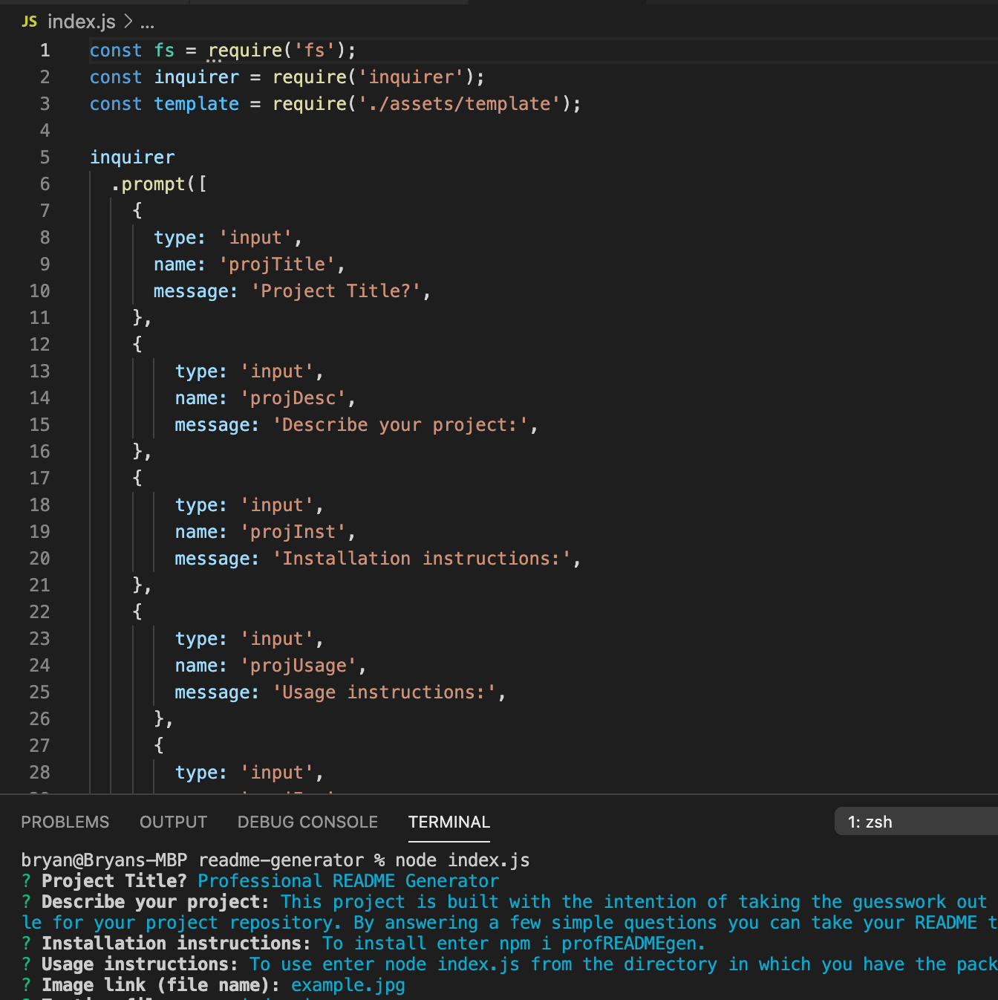

# Professional README Generator

## Description
This project is built with the intention of taking the guesswork out of building a quality README file for your project repository. By answering a few simple questions you can take your README to the next level.
## Table of Contents
- [Installation](#installation)
- [Usage](#usage)
- [Contributions](#contributions)
- [Testing Information](#testing)
- [License](#license)
- [Questions](#questions)
## Installation
Install via the command line using npm.
## Usage
To use, enter "node index.js" from the directory in which you have installed the package.  You can find a detailed video for creating a README [here](https://youtu.be/5iOFvA3ygn0).

## Contributions

## Testing
To test, run 'npm test -- No testing set up for this project.'.

## License
This project is covered under a/an MIT license. For more information see GitHub documentation on licensing a project [here](https://docs.github.com/en/communities/setting-up-your-project-for-healthy-contributions/adding-a-license-to-a-repository).

## Questions
​For questions, get in touch on [GitHub](https://github.com/bryan-barnes12/) or email me at [theonlysweetbeebles@gmail.com](mailto:theonlysweetbeebles@gmail.com).
    